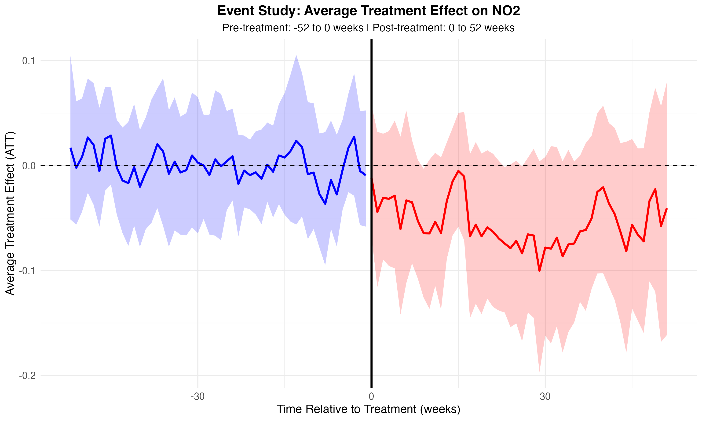
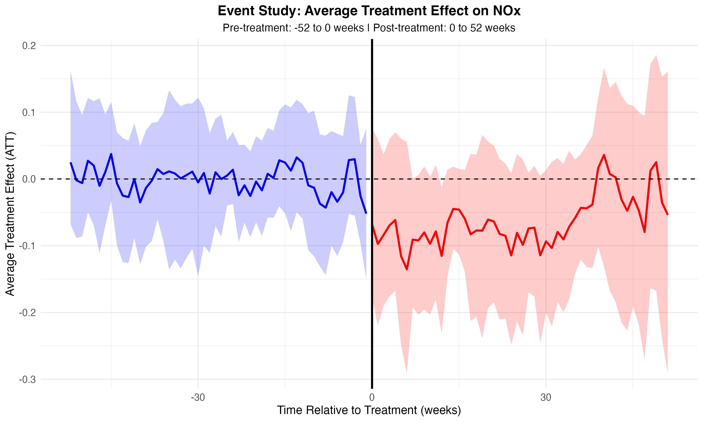
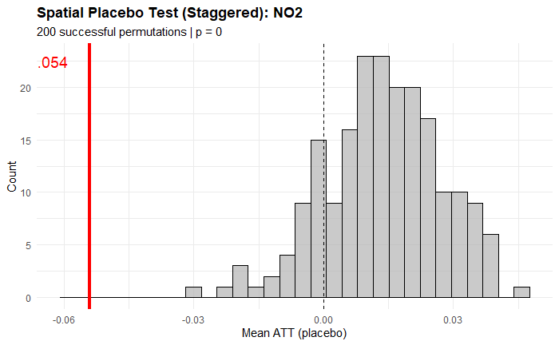
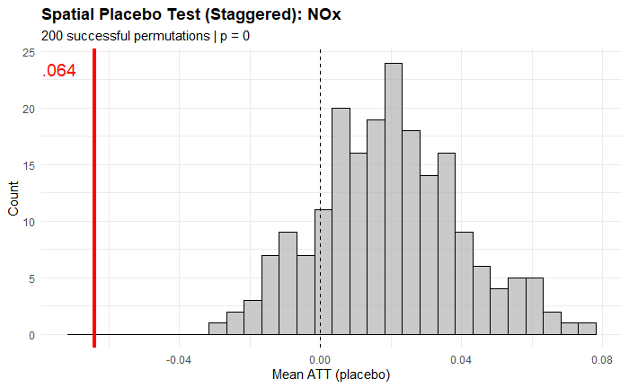
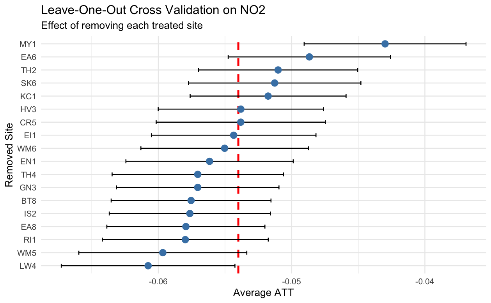

# Causal Impact of London's Ultra Low Emission Zone (ULEZ) on Air Quality

Evaluating the effect of London's staggered ULEZ expansion on NO₂ and NOₓ concentrations using **Random Forest weather normalization** and **partially pooled Synthetic Control Methods** (Ben-Michael et al., 2022).

> 📄 Full thesis: [`docs/Thesis.pdf`](docs/Thesis.pdf)

## Research Question

Did London's Ultra Low Emission Zone — implemented in three staggered phases (Central 2019, Inner 2021, Outer 2023) — reduce roadside NO₂ and NOₓ concentrations, after removing the confounding effects of weather variability?

## Key Findings

| Pollutant | Average Treatment Effect (ATT), 0–52 weeks | Percentage Change | 95% CI |
|-----------|-------------------------------|-------------------|--------|
| NO₂       | −0.054 (log scale)            | ≈ −5.4%           | [−10.5%, +0.3%] |
| NOₓ       | −0.064 (log scale)            | ≈ −6.4%           | [−13.1%, +1.2%] |

> **Interpretation note:** The aggregate 52-week confidence intervals marginally include zero, so the overall effect is best described as *consistently negative but not conclusively significant at the aggregate level*. However, all sub-period estimates (short/mid/long-term) are entirely below zero, and both robustness checks below strongly support a genuine policy effect. This honest framing mirrors the thesis conclusions.

Results are validated by **two robustness checks**: spatial placebo tests (200 permutations, p < 0.005 for both pollutants) and leave-one-out cross-validation (all 18 site exclusions remain negative).

### Event Study: Treatment Effects Over Time

<p align="center">
  
  
</p>

> Blue = pre-treatment period (−52 to 0 weeks); Red = post-treatment period (0 to 52 weeks). Shaded areas = 95% confidence intervals. The consistent negative shift after treatment onset indicates ULEZ-attributable reductions.

### Spatial Placebo Tests (200 Permutations)

<p align="center">
  
  
</p>

> Red lines = observed treatment effects. The observed ATTs fall far outside the placebo distribution, confirming results are not driven by random spatial variation (p < 0.005 for both pollutants).

### Leave-One-Out Cross-Validation

<p align="center">
  
</p>

> All 18 site-exclusion estimates remain negative, demonstrating that no single monitoring site drives the aggregate result.

## Methodology

### Pipeline Overview

```
Hourly pollution data (KCL for London + AURN for control cities)
        │
        ▼
Missing value imputation (Kalman smoothing, maxgap = 48h)
        │
        ▼
Merge with weather data (NOAA surface + ERA5 reanalysis)
        │
        ▼
Random Forest weather normalization (rmweather)
   ├── 500 trees per site
   ├── Predictors: wind speed/direction, temperature, humidity,
   │   pressure, BLH, solar radiation, cloud cover, precipitation,
   │   and temporal features (hour, weekday, month, day_julian)
   └── OOB R² typically 0.77–0.88
        │
        ▼
Weekly aggregation of weather-normalized concentrations
        │
        ▼
Staggered Adoption Synthetic Control (augsynth::multisynth)
   ├── Log-transformed outcomes
   ├── Optimal nu selection via balance frontier (ν = 0.35 for NO₂, 0.25 for NOₓ)
   ├── 52-week pre/post treatment window
   └── Unit fixed effects (fixedeff = TRUE)
        │
        ▼
Robustness checks
   ├── Spatial placebo tests (200 permutations)
   └── Leave-one-out cross-validation
```

### Weather Normalization

Air pollution concentrations are heavily influenced by meteorological conditions. To isolate the policy effect, I use Random Forest models (via the `rmweather` package) to predict hourly pollution concentrations from weather and temporal variables, then generate counterfactual predictions by randomly resampling weather variables 500 times. The resulting weather-normalized series removes meteorological noise while preserving the underlying emission trend. Across the 18 treated sites, models achieve OOB R² of roughly 0.77–0.88, and weather normalization reduces the standard deviation of the series by 29–67%.

### Staggered Synthetic Control

London's ULEZ was rolled out in three phases, creating a staggered adoption setting that violates the simultaneous-treatment assumption of traditional SCM. I use the `augsynth` package's `multisynth` function (Ben-Michael et al., 2022), which constructs a weighted combination of control units (38 monitoring sites across 19 UK cities outside London) to approximate the counterfactual trajectory for each treated unit. The partially pooled estimator balances unit-specific and globally pooled synthetic controls, with the pooling parameter (ν) selected via a balance frontier heuristic. The largest donor weights come from Plymouth, Coventry, Belfast, Leeds, and Nottingham.

## Data Sources

| Data | Source | Access Method |
|------|--------|---------------|
| London pollution (NO₂, NOₓ) — 18 treated sites | King's College London (KCL) network | `openair::importKCL()` |
| UK pollution (38 control sites, 19 cities) | DEFRA AURN network | `openair::importAURN()` |
| Surface weather | NOAA Integrated Surface Database | `worldmet::importNOAA()` |
| Weather variables (all sites) | ERA5 reanalysis (ECMWF) | CDS API (Python script) |

Weather variables from ERA5 include: wind speed, wind direction, air temperature, relative humidity, surface pressure, total cloud cover, boundary layer height, surface solar radiation, and total precipitation.

**Note:** Raw data files are not included in this repository due to size. All data can be reproduced using the provided scripts — see [Reproducing the Analysis](#reproducing-the-analysis).

## Repository Structure

```
london-ulez-air-quality/
│
├── README.md
├── .gitignore
│
├── config/
│   └── sites_config.csv              # Site metadata and treatment assignment
│
├── scripts/
│   ├── 01_download_era5_weather.py   # Download ERA5 data via CDS API
│   ├── 02_prepare_weather.R          # Merge NOAA + ERA5, interpolate missing
│   ├── 03_import_and_normalize.R     # Import pollution → fill gaps → RF normalize
│   ├── 04_build_panel.R              # Consolidate weekly panel data
│   ├── 05_synthetic_control.R        # Nu selection + multisynth estimation
│   ├── 06_robustness_checks.R        # Spatial placebo tests + LOOCV
│   └── utils/
│       ├── fill_missing.R            # Kalman smoothing imputation
│       └── analyze_site.R            # Weather normalization core function
│
├── data/
│   ├── README.md                     # Data dictionary and download instructions
│   └── site_metadata/
│
├── outputs/
│   └── figures/                      # Key result visualizations
│
└── docs/
    └── Thesis.pdf                    # Full thesis document
```

## Reproducing the Analysis

### Prerequisites

**R packages:**
```r
install.packages(c(
  "openair", "worldmet", "rmweather", "ranger",
  "augsynth", "dplyr", "tidyr", "purrr", "lubridate",
  "zoo", "imputeTS", "ggplot2", "readr", "stringr"
))
```

**Python packages** (for ERA5 download only):
```bash
pip install cdsapi xarray netcdf4 pandas numpy
```

You will also need a [CDS API key](https://cds.climate.copernicus.eu/api-how-to) configured in `~/.cdsapirc`.

### Run Order

1. `scripts/01_download_era5_weather.py` — Download ERA5 weather variables for all sites
2. `scripts/02_prepare_weather.R` — Merge NOAA surface weather with ERA5 variables
3. `scripts/03_import_and_normalize.R` — Import pollution data, impute gaps, run RF weather normalization
4. `scripts/04_build_panel.R` — Aggregate to weekly panel, assign treatment cohorts
5. `scripts/05_synthetic_control.R` — Select optimal nu, estimate staggered SCM
6. `scripts/06_robustness_checks.R` — Spatial placebo tests and LOOCV

## Technical Highlights

- **56 monitoring sites** across the UK (18 treated London sites + 38 control sites across 19 cities)
- **~1.1M hourly observations** for the treated London sites (2018–2024)
- **Random Forest models** with OOB R² of 0.77–0.88, confirming strong weather-pollution relationships
- **Weather normalization reduces SD by 29–67%**, effectively removing meteorological noise
- **Optimal nu selection** using Ben-Michael et al. (2022) balance frontier heuristic (ν = 0.35 for NO₂, 0.25 for NOₓ)
- **200-permutation spatial placebo tests** confirm treatment effects are not driven by chance (p < 0.005)
- **Honest reporting**: aggregate CIs marginally include zero, but consistently negative sub-period estimates and robustness checks support a genuine effect

## References

- Ben-Michael, E., Feller, A., & Rothstein, J. (2022). Synthetic Controls with Staggered Adoption. *Journal of the Royal Statistical Society Series B*, 84(2), 351–381.
- Grange, S. K., & Carslaw, D. C. (2019). Using meteorological normalisation to detect interventions in air quality time series. *Science of the Total Environment*, 653, 578–588.
- Abadie, A. (2021). Using Synthetic Controls: Feasibility, Data Requirements, and Methodological Aspects. *Journal of Economic Literature*, 59(2), 391–425.
- Greater London Authority. ULEZ Expansion Reports.

## License

MIT License. See [LICENSE](LICENSE) for details.
